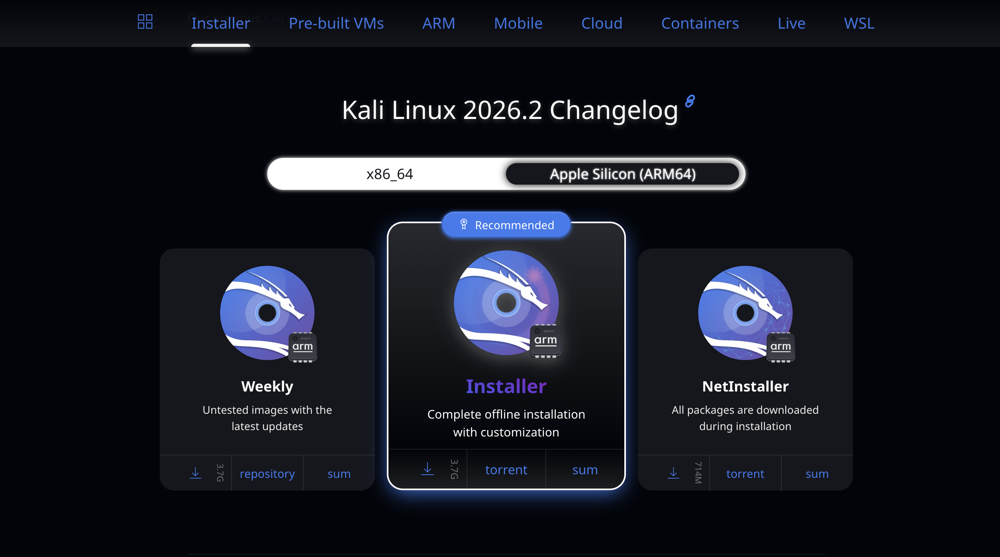
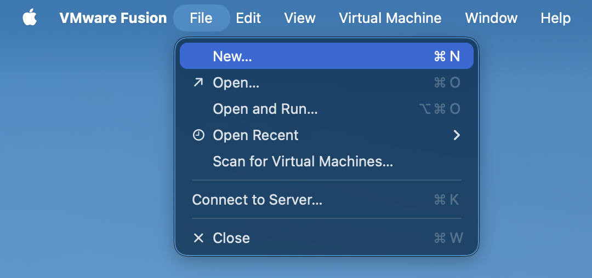
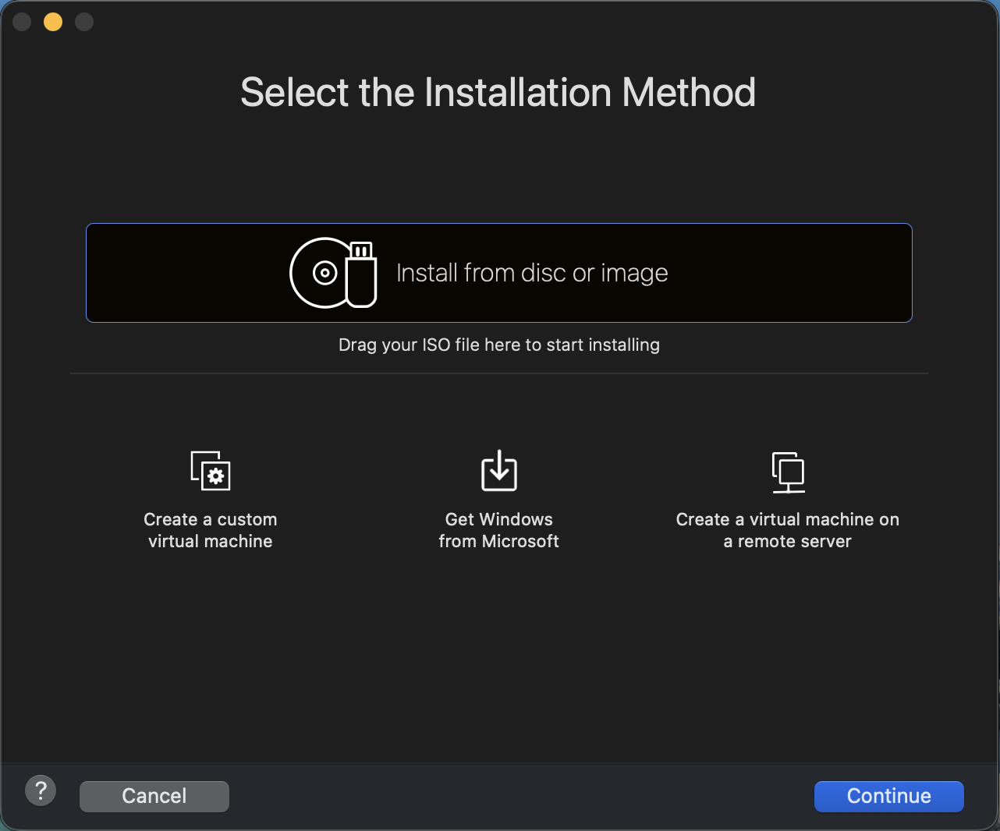
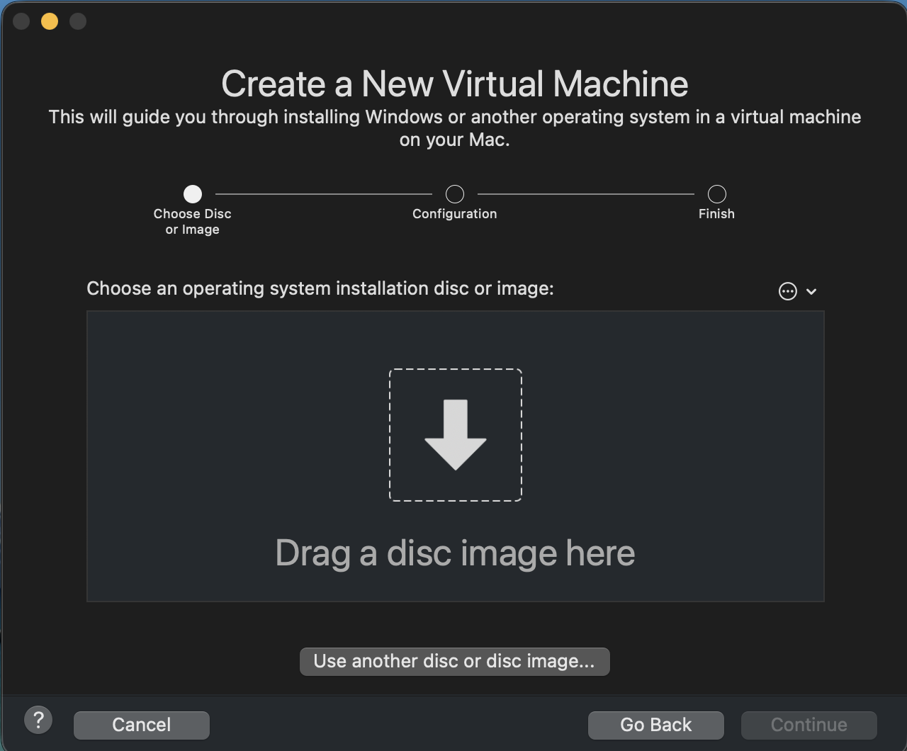
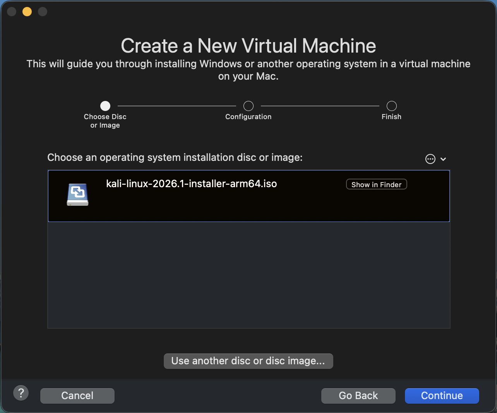
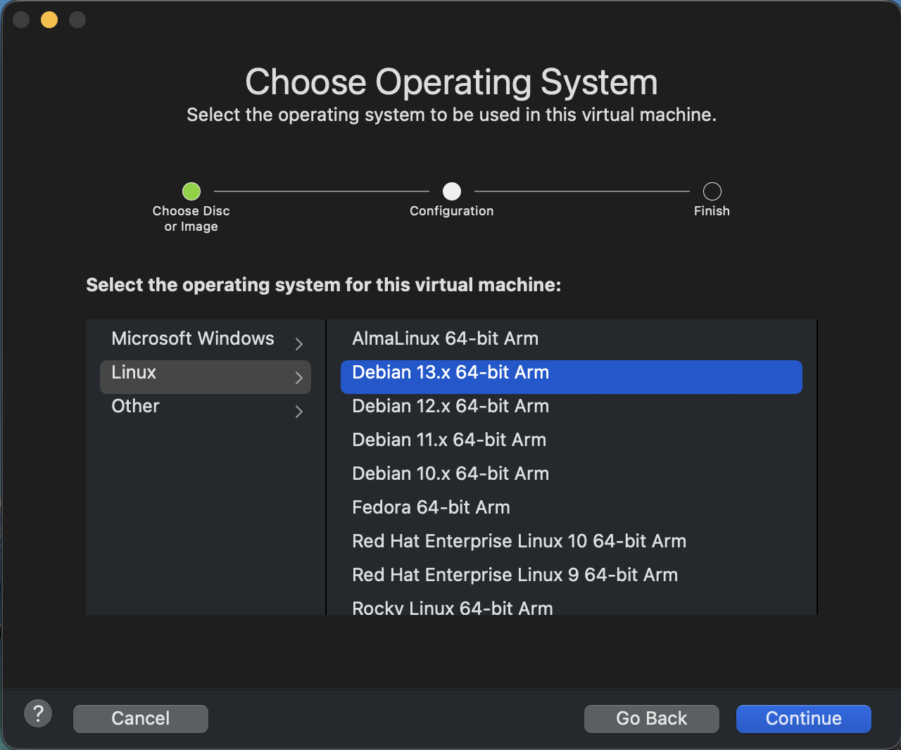
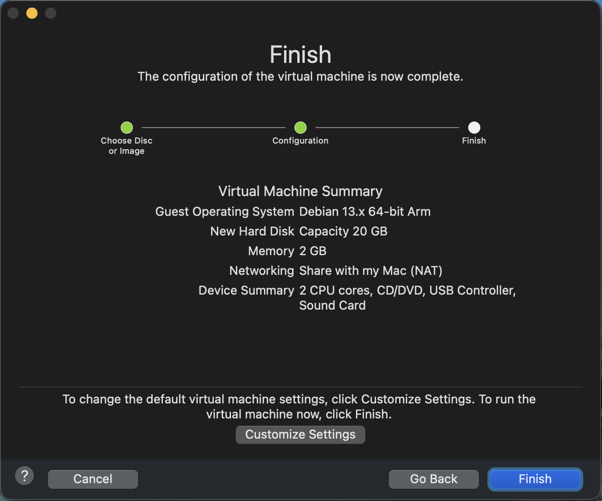
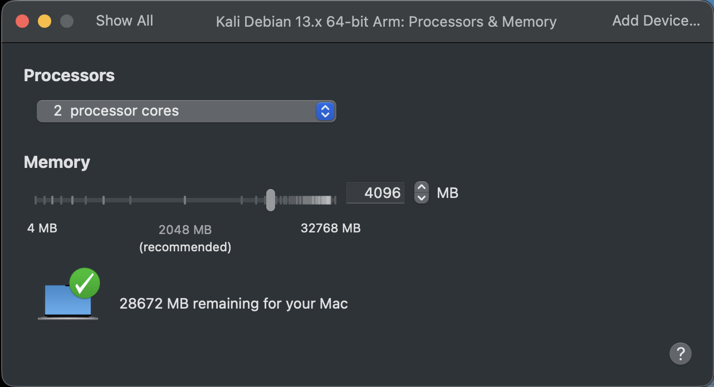
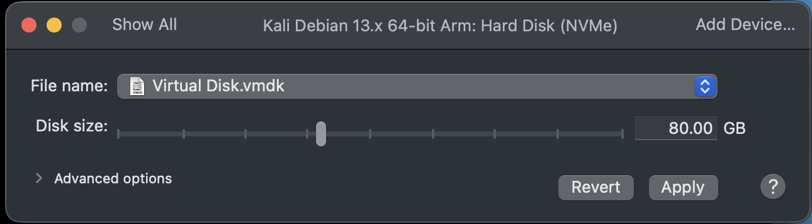

<!-- 03-kalli-setup.md
Last Updated: June 30, 2026

 -->


# Kali Linux Virtual Machine Setup

## Overview

This guide walks through creating and configuring a Kali Linux virtual machine using VMware Fusion. Kali Linux will serve as the primary attack workstation within this lab and will be used to perform penetration testing, command and control (C2) operations, payload generation, and network analysis.

The virtual machine will be connected exclusively to the lab's **Host-Only** network to ensure all activities remain isolated from the public Internet.

---

## Objectives

Upon completion of this guide, you will have:

- A functioning Kali Linux virtual machine
- VMware Tools installed
- A static IP address configured
- Network connectivity to other lab machines
- A clean snapshot ready for future exercises

---

## Prerequisites

Before beginning, ensure you have completed the following:

- [VMware Setup](setup-guides/01-vmware-setup.md)
- [Network Configuration](setup-guides/02-network-setup.md)
- At least **120 GB** of available storage is available.
- At least **16 GB** of physical RAM is installed (32 GB recommended for multiple VMs).
- The latest Kali Linux Installer ISO has been downloaded.


---

# Step 1 — Download Kali Linux

1. Visit the official Kali Linux Downloads page:
   https://www.kali.org/get-kali/#kali-installer-images
2. Download the latest **Apple Silicon (ARM64 bit) Installer ISO**.

3. Save the ISO to your **Downloads** folder or another known location.

Expected download:

```text
kali-linux-YYYY.X-installer-arm64.iso
```

> **Note**
>
> Only download Kali Linux from the official Kali website to ensure the installation media has not been modified.

---

# Step 2 — Create a New Virtual Machine

1. Open **VMware Fusion**.
2. From the menu bar, select **File → New**.

3. Select **Install from disc or image**.

4. Browse to the Kali Linux ISO you downloaded to drag and drop.
 
 |
5. Click **Continue**.
6. VMware Fusion should automatically detect **Linux** as the OS.

If prompted, choose **Linux** as the operating system and **Debian 13.x 64-bit Arm** (or the latest available version) as the guest operating system.

7. Click **Continue**. 

---

# Step 3 — Configure Virtual Hardware

Before you click **Finish**, select **Customize Settings** and review the following configuration.

Configure the following:

| Component | Value |
|----------|------|
| CPUs | 2 |
| Memory | 4096 MB or greater |
| Hard Disk | 80 GB |




---

# Step 4 — Install Kali Linux

Start the virtual machine.

When the boot menu appears:

1. Select **Graphical Install**.
2. Choose your preferred language.
3. Select your region.
4. Configure the keyboard layout.
5. Enter a hostname.

Example:

```text
kali
```

Continue through the installation wizard.

---

# Step 5 — Configure User Account

Create the primary user account.

Example:

```text
Username:
student
```

Choose a strong password.

> **Note**
>
> Modern Kali Linux uses a standard user account instead of the historical root account.

---

# Step 6 — Configure Storage

When prompted:

- Select **Guided — Use Entire Disk**
- Choose the virtual disk
- Select **All files in one partition**
- Confirm the changes

The installer will partition and format the virtual disk automatically.

---

# Step 7 — Complete Installation

After the installation finishes:

1. Install the GRUB boot loader when prompted.
2. Select the virtual disk as the boot device.
3. Finish the installation.
4. Remove the installation ISO if prompted.
5. Reboot the virtual machine.

Log in using the account created during installation.

---

# Step 8 — Install VMware Tools

Installing VMware Tools improves performance and enables features such as:

- Dynamic display resizing
- Improved mouse integration
- Clipboard support
- Shared time synchronization

Install VMware Tools using VMware Fusion and reboot the virtual machine after installation.

---

# Step 9 — Configure the Network

Verify the virtual machine is connected to the Host-Only adapter.

Confirm the assigned IP address.

Example:

```text
192.168.100.10/24
```

Verify connectivity to the remaining lab systems once they have been deployed.

---

# Step 10 — Update the Operating System

If Internet access is temporarily enabled during the initial build, update Kali Linux before isolating the environment.

```bash
sudo apt update
sudo apt full-upgrade -y
```

After updating:

- Shut down the virtual machine.
- Disconnect Internet access.
- Reconnect the Host-Only adapter.

The remainder of this lab should operate entirely within the isolated environment.

---

# Step 11 — Create a Baseline Snapshot

Once the installation is complete and verified:

1. Shut down the virtual machine.
2. Create a VMware snapshot.

Suggested snapshot name:

```text
Fresh Kali Installation
```

This snapshot provides a clean restore point before installing offensive security tools or performing lab exercises.

---

# Verification Checklist

Confirm the following before proceeding:

- VMware Fusion boots the VM successfully
- Kali Linux loads without errors
- Host-Only networking is functional
- Static IP address configured
- VMware Tools installed
- System updated
- Baseline snapshot created

---

# Next Steps

Continue with the following guides:

- Windows 10 Victim Setup
- Windows Server Setup
- Security Onion Setup
- Host-Only Network Configuration

---

# Troubleshooting

## Virtual machine does not boot

- Verify the ISO was mounted correctly.
- Confirm the firmware is set to UEFI.
- Ensure sufficient RAM has been allocated.

---

## No network connectivity

- Verify the network adapter is configured as **Host-Only**.
- Confirm the correct virtual network is selected.
- Verify the assigned IP address.

---

## VMware Tools installation fails

- Confirm the VMware Tools ISO is mounted.
- Reboot the virtual machine.
- Retry the installation.

---

## References

- Kali Linux Documentation
- VMware Fusion Documentation

<!-- # 🚧 Coming Soon

<p align="center">
  
</p>
-->

