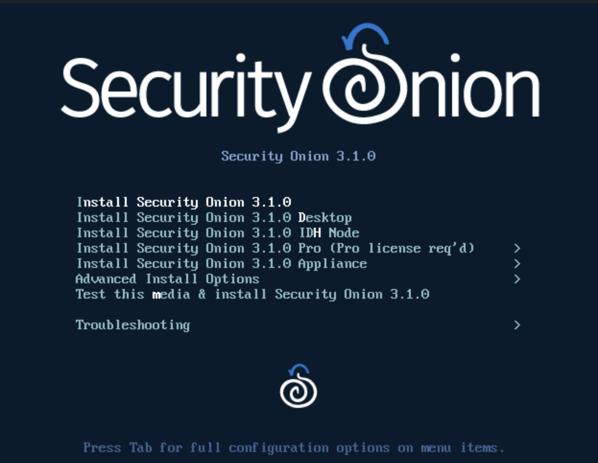
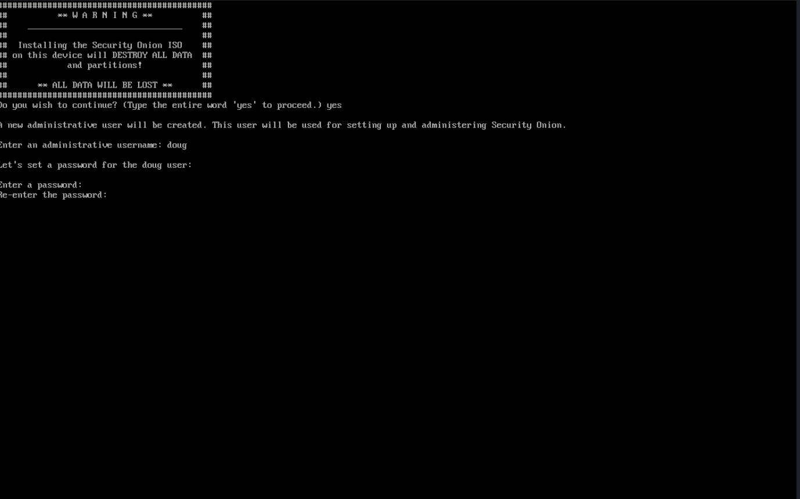

<!-- 04-security-onion-setup.md
Last Updated: July 13, 2026

 -->

# Security Onion Setup

> **Note** For up to date instructions, [ ⬇️ Click Here](https://github.com/Security-Onion-Solutions/securityonion/blob/3/main/DOWNLOAD_AND_VERIFY_ISO.md).


## Step 1. Download and Verify

### 3.1.0-20260528 ISO image released on 2026/05/28


3.1.0-20260528 ISO image:  
https://download.securityonion.net/file/securityonion/securityonion-3.1.0-20260528.iso
 
MD5: 9D6FF58DEEE24089D722C73169765B3E  
SHA1: 2B8B816B6CEC3B7F96B3C5E040EBF502DD2C412F  
SHA256: 62FAB57E247C843D6A04F0796D8162C732B65D82FC3E4A59D087135B9FD32912  

Signature for ISO image:  
https://github.com/Security-Onion-Solutions/securityonion/raw/3/main/sigs/securityonion-3.1.0-20260528.iso.sig

Signing key:  
https://raw.githubusercontent.com/Security-Onion-Solutions/securityonion/3/main/KEYS  

For example, here are the steps you can use on most Linux distributions to download and verify our Security Onion ISO image.

Download and import the signing key:  
```
wget https://raw.githubusercontent.com/Security-Onion-Solutions/securityonion/3/main/KEYS -O - | gpg --import -  
```

Download the signature file for the ISO:  
```
wget https://github.com/Security-Onion-Solutions/securityonion/raw/3/main/sigs/securityonion-3.1.0-20260528.iso.sig
```

Download the ISO image:  
```
wget https://download.securityonion.net/file/securityonion/securityonion-3.1.0-20260528.iso
```

Verify the downloaded ISO image using the signature file:  
```
gpg --verify securityonion-3.1.0-20260528.iso.sig securityonion-3.1.0-20260528.iso
```

The output should show "Good signature" and the Primary key fingerprint should match what's shown below:
```
gpg: Signature made Wed 27 May 2026 03:03:59 PM EDT using RSA key ID FE507013
gpg: Good signature from "Security Onion Solutions, LLC <info@securityonionsolutions.com>"
gpg: WARNING: This key is not certified with a trusted signature!
gpg:          There is no indication that the signature belongs to the owner.
Primary key fingerprint: C804 A93D 36BE 0C73 3EA1  9644 7C10 60B7 FE50 7013
```

If it fails to verify, try downloading again. If it still fails to verify, try downloading from another computer or another network.

Once you've verified the ISO image, you're ready to proceed to the next steps: 

## Step 2. Installation via VMWare Fusion

VMware Fusion is available for Mac OS. For more information about VMware Fusion, please see: https://www.vmware.com/products/fusion.html.

Follow the steps below to create a VM in VMware Fusion for our ISO image:

- From the VMware Fusion main window, click `File` and then click `New`.
- Select the Installation Method appears. Click `Install from disc or image` and click `Continue`.
- `Create a New Virtual Machine` appears. Click `Use another disc or disc image...,` locate and select the ISO image downloaded in step 1, click `Open`, then click `Continue`.
- Choose Operating System appears. Click `Linux`, choose the closest Linux distribution, then click `Continue`.
- `Choose Firmware Type` appears. Click `Legacy BIOS` and then click `Continue`.
- `Finish screen` appears. Click the `Customize Settings` button.
- `Save As` screen appears. Give the VM a name and click the `Save` button.
- `Settings` window appears. Click `Processors & Memory`.
- `Processors & Memory` screen appears. Increase processors and memory based on the `Hardware` guide: https://docs.securityonion.net/en/3/main/hardware/#minimum-specs. Click the `Add Device...` button.
- `Add Device` screen appears. Click `Network Adapter` and click the `Add...` button.
- `Network Adapter 2` screen appears. This will be the sniffing (monitor) interface. Select your desired network adapter configuration. Click the `Show All` button.
- Settings screen appears. Click `Hard Disk (SCSI)`.
- `Hard Disk (SCSI)` screen appears. Increase the disk size to at least 200GB depending on your use case. Click the `Apply` button.
- Close the `Settings` window.
- At the window for your new VM, click the `Play` button to power on the virtual machine.

## Step 3. Enable Virtualization Technology (VT-x)

> **Note:** VM couldn't boot due to a system error: `The host supports Intel VT-x, but Intel VT-x is disable`

### Fix Step 1: Enable Intel Virtualization in BIOS
1.  Shut down the system completely
2. Power it on and press F1 repeatedly to enter the BIOS Setup.
3. Navigate: Security --> Virtualization
4.  Make sure these are enabled:
    > `Intel (R) Virtualization Technology (VT-x). `    `Intel VT-d Feature (optional but recommended)`
5.  Press F10 to Save and Exit.

### Fix Step 2: Make sure Firmware Type is `UEFI` and not `BIOS`

- 

## Step 4: Advance Installation


After booting the ISO image, the boot menu appears:



When prompted, enter your desired username and password:

 

 
 > **Note** For the rest of this setup, see: 
 https://docs.securityonion.net/en/3/main/first-time-users/


## References:

- [Security Onion Documentation](https://docs.securityonion.net/en/3/main/first-time-users/)


 <!-- 

# 🚧 Coming Soon

<p align="center">
  
</p>

-->
